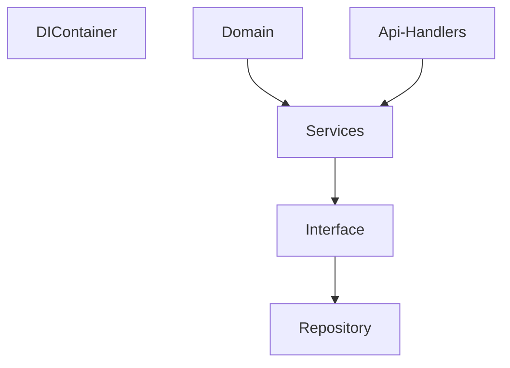

## Описание

### API Handlers

+ - [x] Получение списка всех задач: GET /tasks
      + Возвращает список всех задач из базы данных.

+ - [x] Возвращает список всех задач из базы данных.
     + Возвращает задачу по task_id.
     + Если задача не найдена, возвращает 404 Not Found.

+ - [x] Создание задачи: POST /tasks
     + Принимает JSON с данными о задаче.
     + Возвращает id созданной задачи.

+ - [x] Обновление задачи: PUT /tasks/{task_id}
    + Принимает JSON с обновленными данными задачи.
    + Возвращает полностью обновленную задачу.
    + Если задача не найдена, возвращает 404 Not Found.

+ - [x] Удаление задачи: DELETE /tasks/{task_id}
    + Удаляет задачу из базы данных.
    + Ничего не возвращает в теле ответа.

### Результат

- [x] Рабочее API, соответствующее требованиям.
- [x] Код, написанный в асинхронном стиле (async def).
- [x] Использование Alembic для создания таблицы tasks.
- [x] Хорошую архитектуру проекта (разбиение на сервисы, репозитории и т.д.).
- [x] Использование pydantic-схемы для валидации входных и выходных данных.
- [x] Использование инъекции зависимостей.
- [x] Соответствие PEP8.
- [x] Покрытие type hints.

### Архитектура проекта

В проекте реализована слоистая архитектура на основе Dependency Injection

+ **Domain** - основные сущности приложения, реализованные в виде dataclasses.
+ **Repository** - слой, который отвечает за I/O логику взаимодействия с хранилищем.
+ **Services** - слой, где реализована основная бизнес-логика. Взаимодействует с репозиторием на основе интерфейсов в 
виде абстрактные классов.
+ **API Handlers** - слой апи, где приложение может взаимодействовать с внешним миром, принимать запросы.
+ **DIContainer** - контейнер, где регистрируются и настраиваются внешние сущности для всех зависимостей.

### Технологии

| Название   | Версия   |
|------------|----------|
| FastApi    | 0.115.11 |
| Pydantic   | 2.10.6   |
| Alembic    | 1.14.1   |
| SQLAlchemy | 2.0.38   |
| SQLite     |          |

## Как запустить

+ Клонировать репозиторий: git clone git@github.com:gMerl1n/test_task.git
----
+  Запустить из докера:
   + docker-compose build
   + docker-compose up
   + После этого приложение будет доступно на порту 11022
----
+ Запустить без докера:
  + Создать виртуальное окружение: python3 -m venv venv
  + Активировать виртуальное окружение: 
    + \venv\Scripts\activate (Windows)
    + source venv/biv/activate (Linux)
  + Запустить командой из папки cmd: uvicorn main:app --reload --host 0.0.0.0 --port 11022